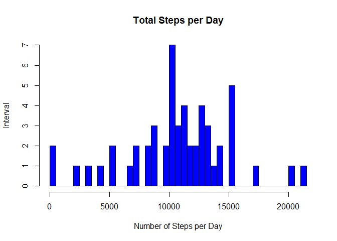
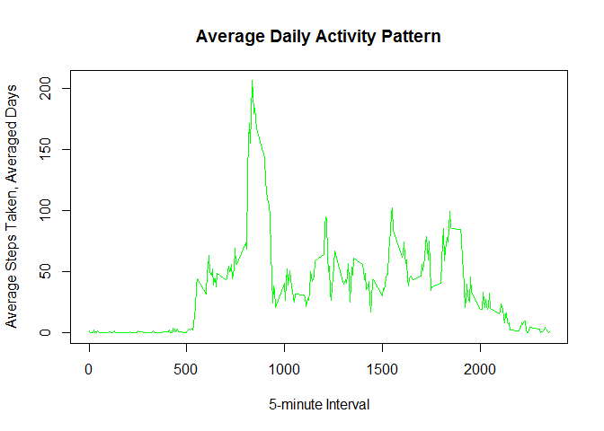
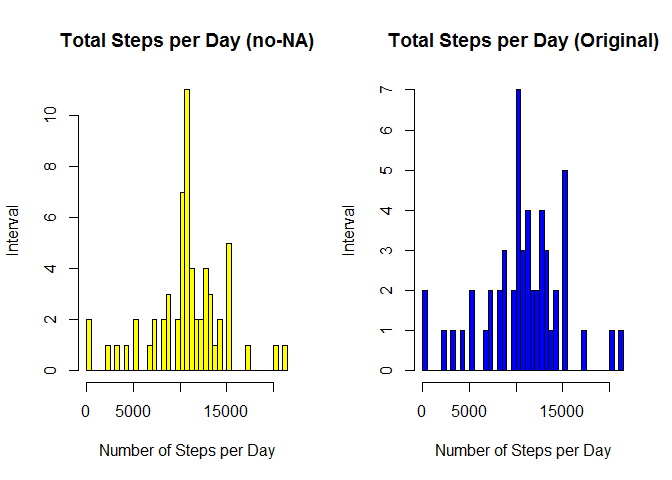

## Loading and preprocessing the data

```r
Sys.setlocale("LC_ALL","English")
```

```
## [1] "LC_COLLATE=English_United States.1252;LC_CTYPE=English_United States.1252;LC_MONETARY=English_United States.1252;LC_NUMERIC=C;LC_TIME=English_United States.1252"
```


```r
temp <- tempfile()
download.file("https://d396qusza40orc.cloudfront.net/repdata%2Fdata%2Factivity.zip", temp, mode="wb")
unzip(temp, "activity.csv")
activity <- read.csv("activity.csv",header=T)
unlink(temp)
```


## What is mean total number of steps taken per day?
(For this part of the assignment, you can ignore the missing values in the dataset.)

1. Calculate the total number of steps taken per day.

```r
totalstepsday <- aggregate(steps ~ date, data = activity, FUN = sum, na.rm = TRUE)
head(totalstepsday)
```

```
##         date steps
## 1 2012-10-02   126
## 2 2012-10-03 11352
## 3 2012-10-04 12116
## 4 2012-10-05 13294
## 5 2012-10-06 15420
## 6 2012-10-07 11015
```

2. If you do not understand the difference between a histogram and a barplot, research the difference between them. Make a histogram of the total number of steps taken each day. 

```r
## converting dates to Y-M-D format
activity$date <- as.Date(activity$date, "%Y-%m-%d")

## calculate steps as it relates to date using SUM (per day)
hist(totalstepsday$steps, 
    main="Total Steps per Day", 
    xlab="Number of Steps per Day", 
    ylab = "Interval",
    col="blue",
    breaks=50)
```

<!-- -->

3. Calculate and report the mean and median of the total number of steps taken per day.

```r
## Mean of total number of steps taken per day
mean_steps <- mean(totalstepsday$steps)
mean_steps
```

```
## [1] 10766.19
```


```r
## Median of total naumber of steps taken per day
median_steps <- median(totalstepsday$steps)
median_steps
```

```
## [1] 10765
```


```r
## Check work 
summary(totalstepsday)
```

```
##          date        steps      
##  2012-10-02: 1   Min.   :   41  
##  2012-10-03: 1   1st Qu.: 8841  
##  2012-10-04: 1   Median :10765  
##  2012-10-05: 1   Mean   :10766  
##  2012-10-06: 1   3rd Qu.:13294  
##  2012-10-07: 1   Max.   :21194  
##  (Other)   :47
```


## What is the average daily activity pattern?
1. Make a time series plot (i.e. 𝚝𝚢𝚙𝚎 = "𝚕") of the 5-minute interval (x-axis) and the average number of steps taken, averaged across all days (y-axis)

```r
## five minute average using steps to interval and FUN = mean instead of sum
fivemin_average <- aggregate(steps ~ interval, data = activity, FUN = mean, na.rm = TRUE)

## Time Series Plot
plot(x = fivemin_average$interval, 
    y = fivemin_average$steps, 
    type = "l", 
    main = "Average Daily Activity Pattern",
    xlab = "5-minute Interval",
    ylab = "Average Steps Taken, Averaged Days",
    col = "green")
```

<!-- -->

2. Which 5-minute interval, on average across all the days in the dataset, contains the maximum number of steps?

```r
maxsteps <- fivemin_average$interval[which.max(fivemin_average$steps)]
maxsteps
```

```
## [1] 835
```

## Imputing missing values
Note that there are a number of days/intervals where there are missing values (coded as NA). The presence of missing days may introduce bias into some calculations or summaries of the data.

1. Calculate and report the total number of missing values in the dataset (i.e. the total number of rows with 𝙽𝙰s)

```r
activity2 <- activity
NAs <- is.na(activity2$steps)
sum(NAs)
```

```
## [1] 2304
```

2. Devise a strategy for filling in all of the missing values in the dataset. The strategy does not need to be sophisticated. For example, you could use the mean/median for that day, or the mean for that 5-minute interval, etc.

```r
avg_interval <- tapply(activity2$steps, activity2$interval, mean, na.rm=TRUE, simplify = TRUE)
activity2$steps[NAs] <- avg_interval[as.character(activity2$interval[NAs])]
names(activity2)
```

```
## [1] "steps"    "date"     "interval"
```

3. Create a new dataset that is equal to the original dataset but with the missing data filled in.

```r
## Check for no-NA
sum(is.na(activity2))
```

```
## [1] 0
```


```r
str(activity2)
```

```
## 'data.frame':	17568 obs. of  3 variables:
##  $ steps   : num  1.717 0.3396 0.1321 0.1509 0.0755 ...
##  $ date    : Date, format: "2012-10-01" "2012-10-01" ...
##  $ interval: int  0 5 10 15 20 25 30 35 40 45 ...
```


4. Make a histogram of the total number of steps taken each day and calculate and report the mean and median total number of steps taken per day. Do these values differ from the estimates from the first part of the assignment? What is the impact of imputing missing data on the estimates of the total daily number of steps?

```r
## Setting up the pannel for one row and two columns
par(mfrow=c(1,2))

## Similar analysis without NAs 
totalstepsday2 <- aggregate(steps ~ date, data = activity2, FUN = sum, na.rm = TRUE)
head(totalstepsday2)
```

```
##         date    steps
## 1 2012-10-01 10766.19
## 2 2012-10-02   126.00
## 3 2012-10-03 11352.00
## 4 2012-10-04 12116.00
## 5 2012-10-05 13294.00
## 6 2012-10-06 15420.00
```

```r
## Histogram without the NA values
hist(totalstepsday2$steps, 
    main = "Total Steps per Day (no-NA)", 
    xlab = "Number of Steps per Day", 
    ylab = "Interval",
    col="yellow",
    breaks=50)
##Histogram with the orginal dataset
hist(totalstepsday$steps, 
    main="Total Steps per Day (Original)", 
    xlab="Number of Steps per Day", 
    ylab = "Interval",
    col="blue",
    breaks=50)
```

<!-- -->


```r
## Resetting the panel
par(mfrow=c(1,1))

## What is the impact of imputing data?
summary(totalstepsday)
```

```
##          date        steps      
##  2012-10-02: 1   Min.   :   41  
##  2012-10-03: 1   1st Qu.: 8841  
##  2012-10-04: 1   Median :10765  
##  2012-10-05: 1   Mean   :10766  
##  2012-10-06: 1   3rd Qu.:13294  
##  2012-10-07: 1   Max.   :21194  
##  (Other)   :47
```

```r
summary(totalstepsday2)
```

```
##       date                steps      
##  Min.   :2012-10-01   Min.   :   41  
##  1st Qu.:2012-10-16   1st Qu.: 9819  
##  Median :2012-10-31   Median :10766  
##  Mean   :2012-10-31   Mean   :10766  
##  3rd Qu.:2012-11-15   3rd Qu.:12811  
##  Max.   :2012-11-30   Max.   :21194
```

```r
## Mean and median values are almost identical, but the quantiles are significantly different.
```


## Are there differences in activity patterns between weekdays and weekends?
1. Create a new factor variable in the dataset with two levels – “weekday” and “weekend” indicating whether a given date is a weekday or weekend day.

```r
## Data has three fields now
head(activity2)
```

```
##       steps       date interval
## 1 1.7169811 2012-10-01        0
## 2 0.3396226 2012-10-01        5
## 3 0.1320755 2012-10-01       10
## 4 0.1509434 2012-10-01       15
## 5 0.0754717 2012-10-01       20
## 6 2.0943396 2012-10-01       25
```


```r
## Add the new weekend/weekday field
activity3 <- activity2                                         
activity3$weekday <- weekdays(activity3$date)   # Convert dates to weekdays
library(dplyr)
```

```
## 
## Attaching package: 'dplyr'
```

```
## The following objects are masked from 'package:stats':
## 
##     filter, lag
```

```
## The following objects are masked from 'package:base':
## 
##     intersect, setdiff, setequal, union
```

```r
activity3<- activity3 %>%
        mutate(typeofaday = ifelse(weekday=="Saturday" | weekday=="Sunday", "Weekend", "Weekday"))

# Print converted data to console
head(activity3)                                    
```

```
##       steps       date interval weekday typeofaday
## 1 1.7169811 2012-10-01        0  Monday    Weekday
## 2 0.3396226 2012-10-01        5  Monday    Weekday
## 3 0.1320755 2012-10-01       10  Monday    Weekday
## 4 0.1509434 2012-10-01       15  Monday    Weekday
## 5 0.0754717 2012-10-01       20  Monday    Weekday
## 6 2.0943396 2012-10-01       25  Monday    Weekday
```

2. Make a panel plot containing a time series plot (i.e. 𝚝𝚢𝚙𝚎 = "𝚕") of the 5-minute interval (x-axis) and the average number of steps taken, averaged across all weekday days or weekend days (y-axis). See the README file in the GitHub repository to see an example of what this plot should look like using simulated data.

```r
## Plot - Line chart
attach(activity3)
fivemin_average2 <- aggregate(steps, list(interval, typeofaday), mean)
detach(activity3)
head(fivemin_average2)
```

```
##   Group.1 Group.2          x
## 1       0 Weekday 2.25115304
## 2       5 Weekday 0.44528302
## 3      10 Weekday 0.17316562
## 4      15 Weekday 0.19790356
## 5      20 Weekday 0.09895178
## 6      25 Weekday 1.59035639
```


```r
library(lattice)
xyplot(x ~ Group.1|Group.2,data=fivemin_average2,type="l",layout=c(1,2),xlab="Interval",ylab="Number of Steps")
```

<!-- -->

